# Full stack MERN workflow

## 0. Initialize project

## 1. Set up express
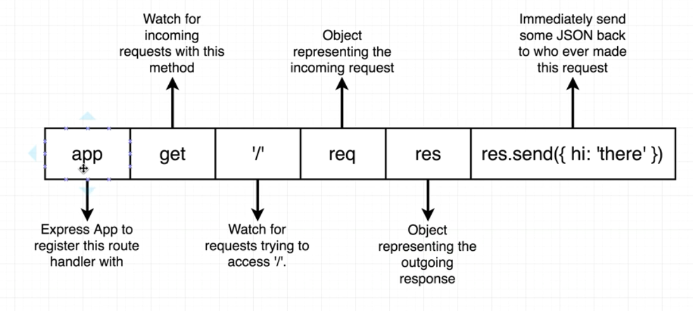

## 2. Pre-deployment checklist
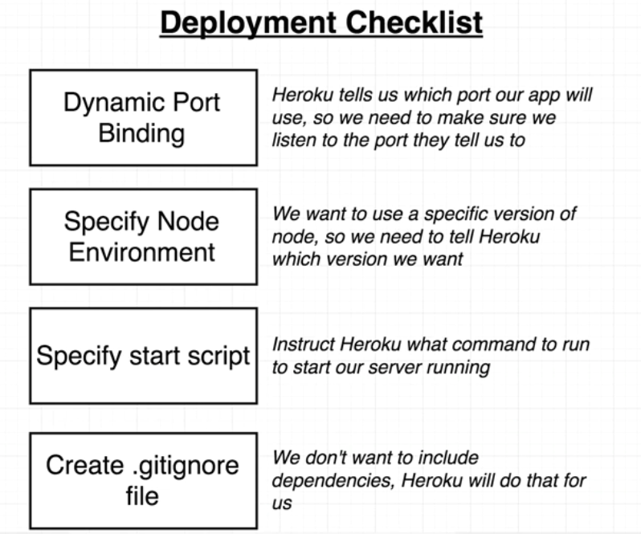

## 3. Heroku deployment
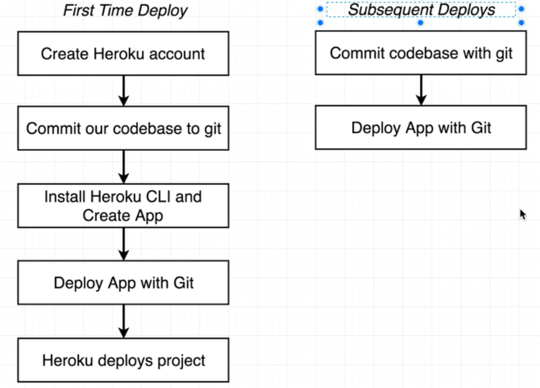

## 4. Develop authentication strategy
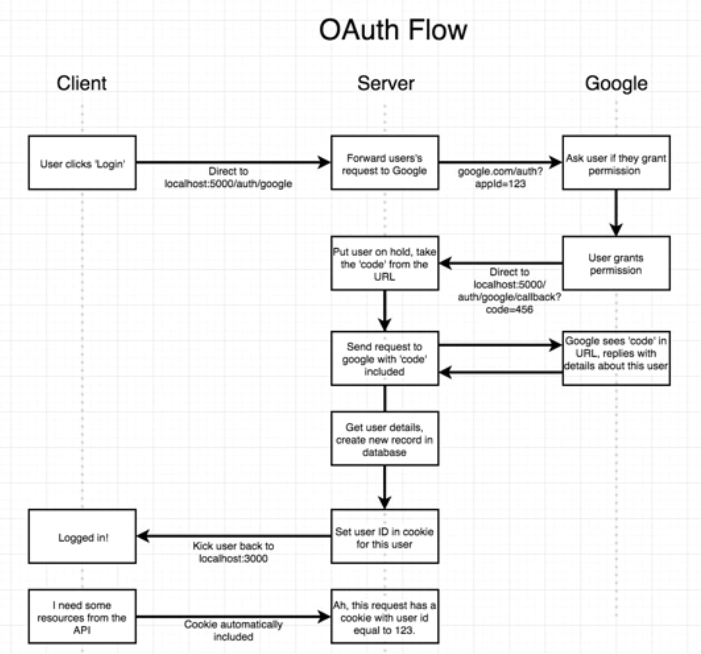

## 5. Install passport to help with authentication
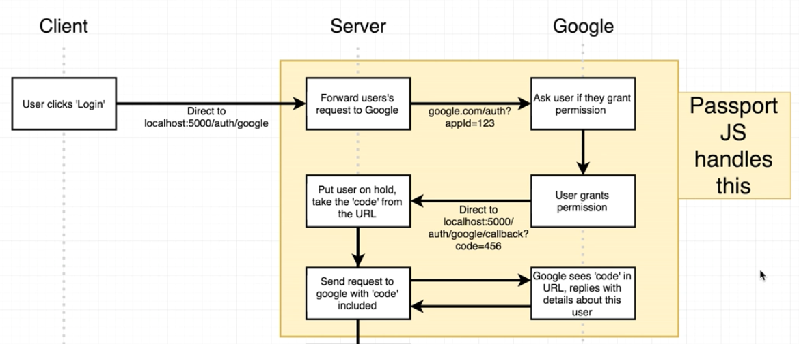

## 6. Get clientID and clientSecret from authentication platform
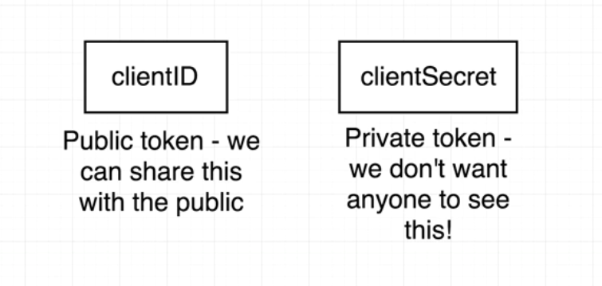

## 7. Set up hidden config keys
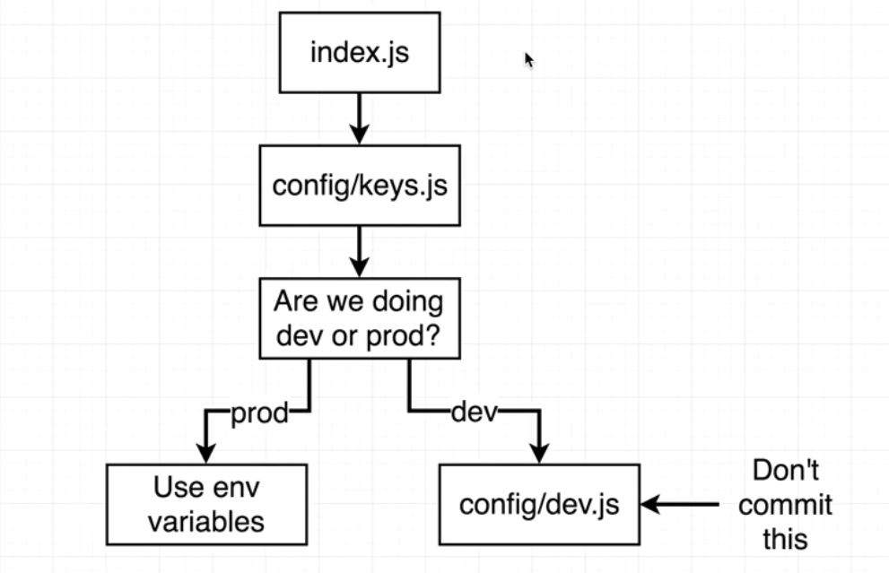

## 8. Organize project folders
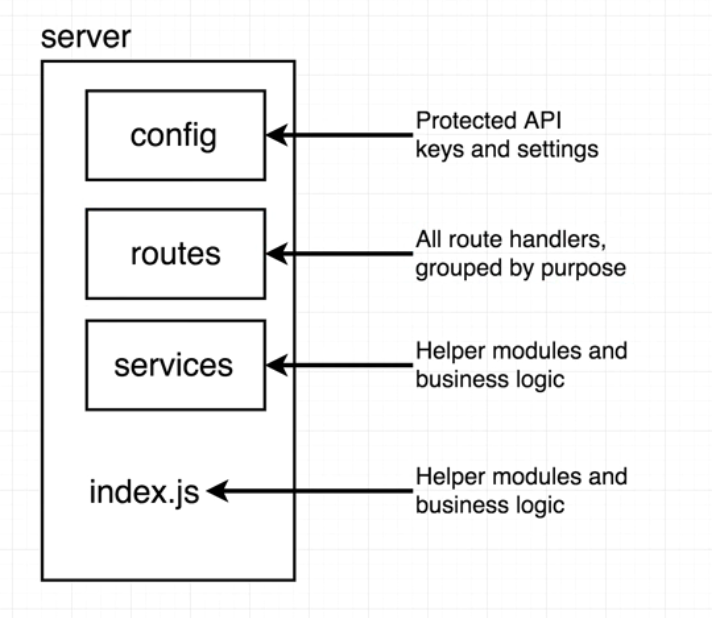

## 9. Add MongoDB for saving users
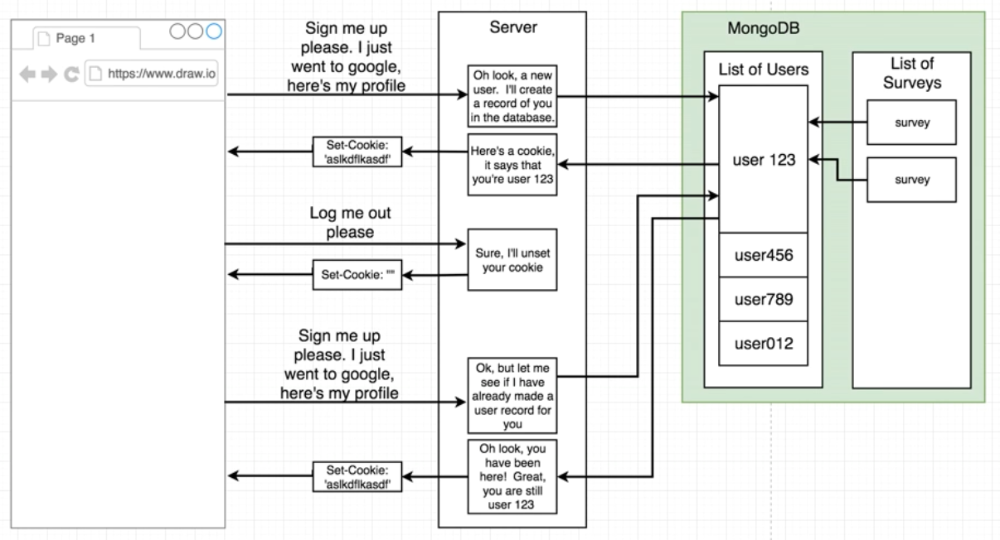

## 10. Install passport for use with MongoDB
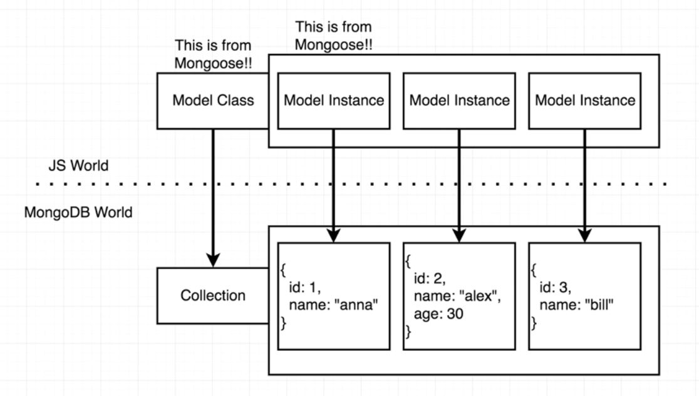

## 11. Create authentication routes
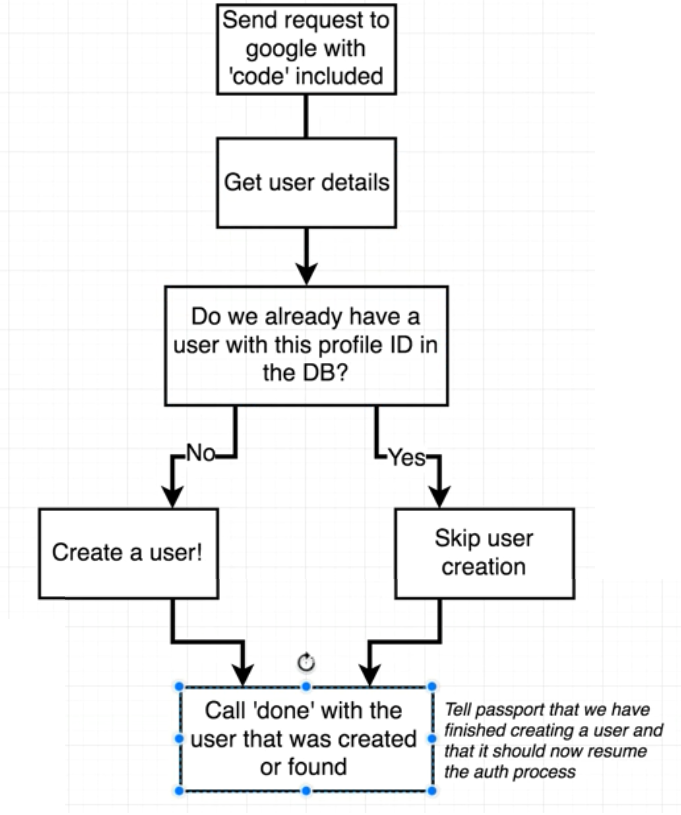

## 12. Install cookie manager
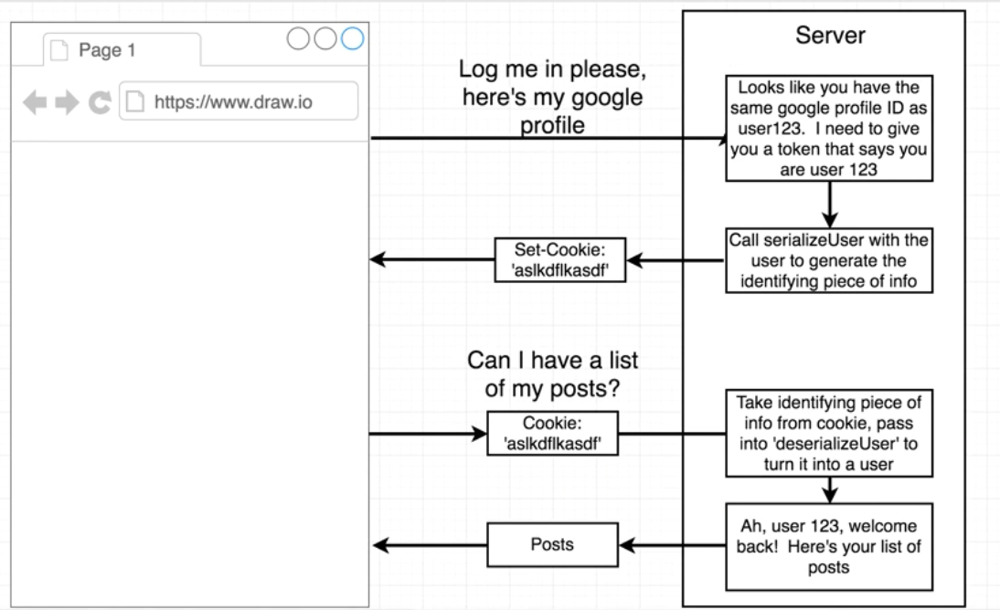

## 13. Coordinate cookie manager with passport
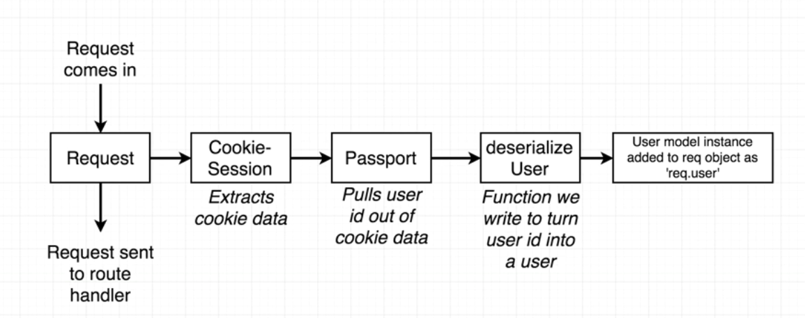

## 14. Create separate production keys
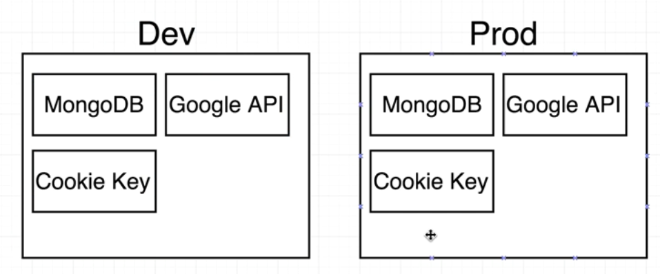

## 15. Commit production keys
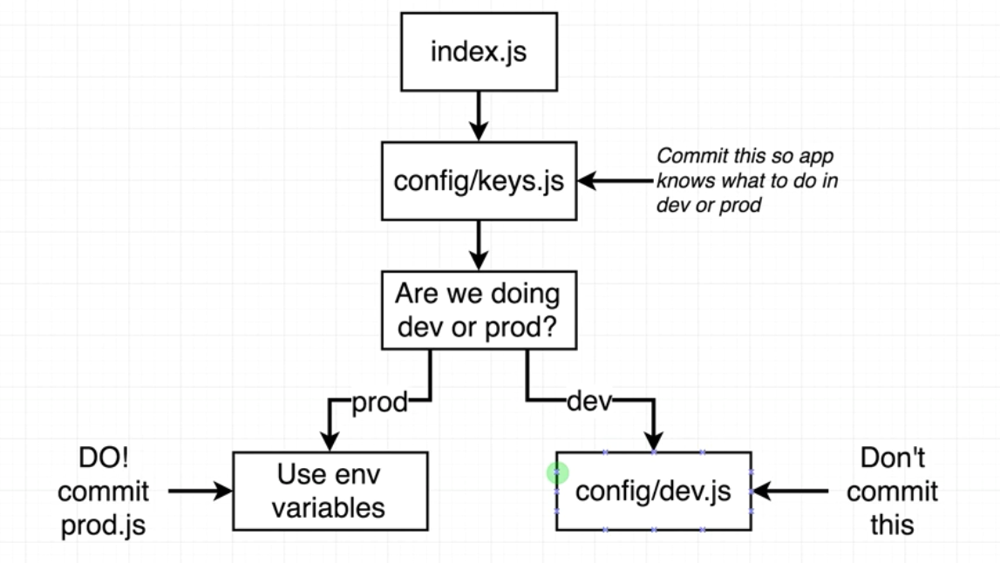

## 16. Create react app on separate server
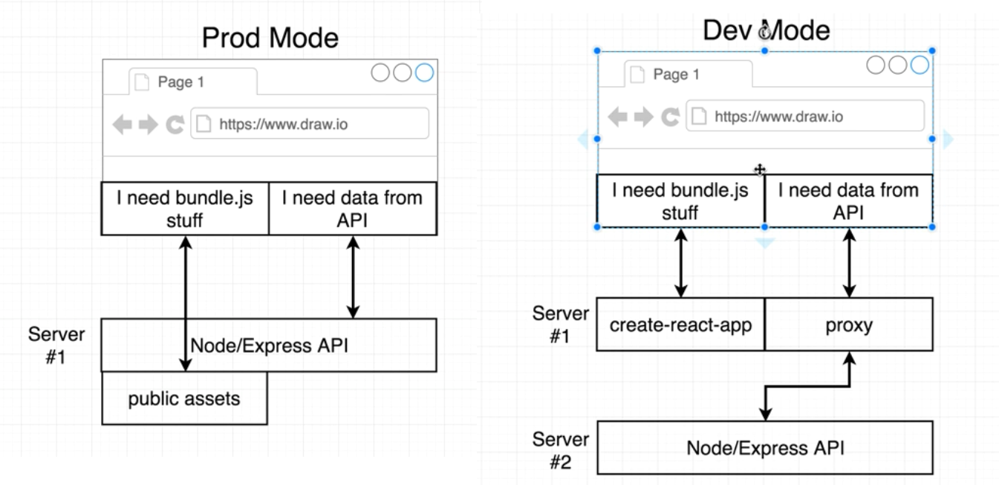